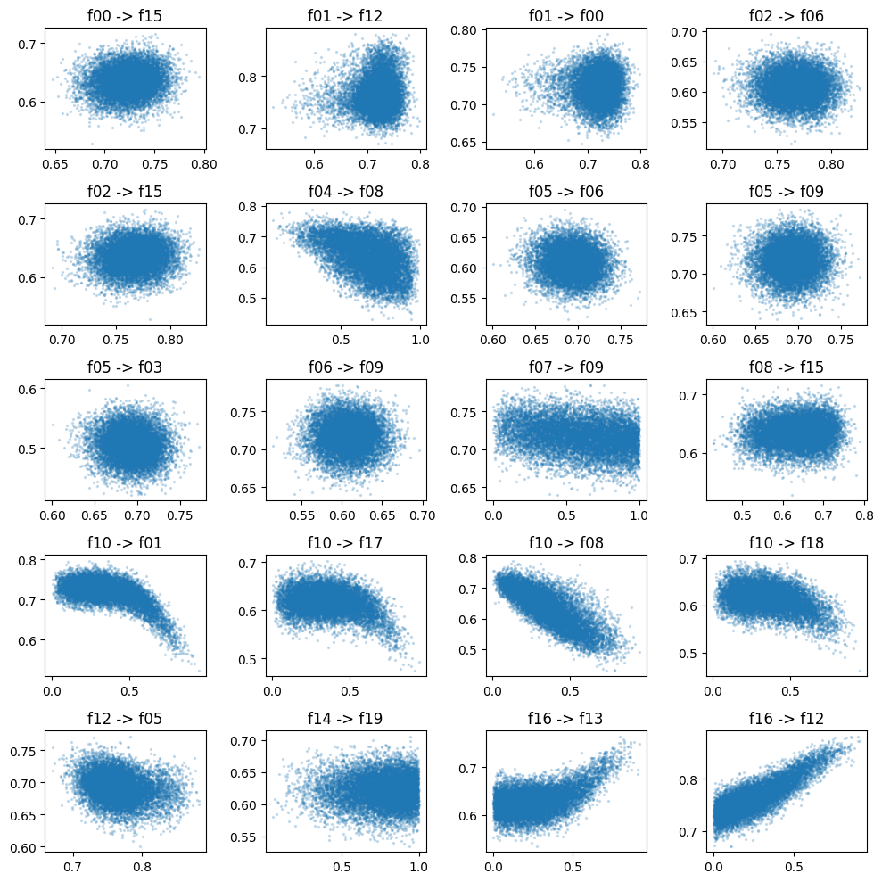
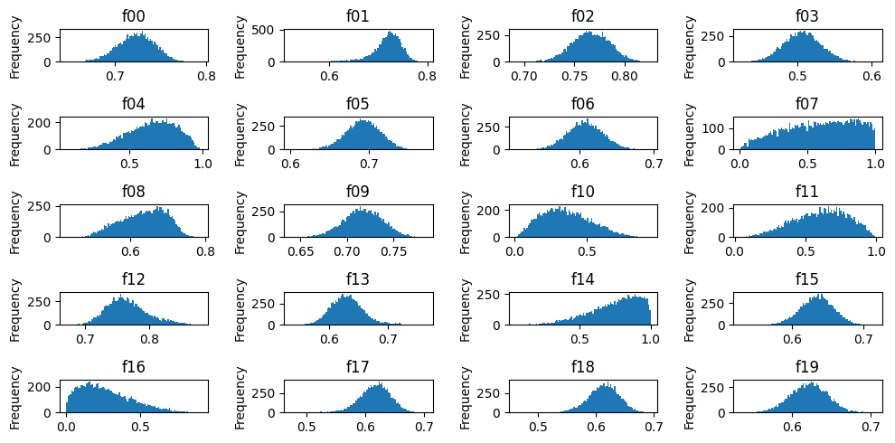

Construction
============

.. code:: ipython3

    import matplotlib.pyplot as plt
    import networkx as nx
    import numpy as np

To get started, we essentially need two things:

-  A graph construction method (see :doc:`dags`)
-  A construction method for the conditionals (see :doc:`conditionals`)

.. code-block:: ipython3

    from bn_testing.models import BayesianNetwork
    from bn_testing.dags import ErdosReny
    from bn_testing.conditionals import PolynomialConditional

.. code-block:: ipython3

    model = BayesianNetwork(
        n_nodes=20,
        dag=ErdosReny(p=0.1),
        conditionals=PolynomialConditional(max_terms=2),
        random_state=20)

.. code:: python

    model.show()

.. image:: figures/dag.png

After the model has been generated, all transformations have been
stored in :code:`model.transformations`:

.. parsed-literal::

    {
      'f00': 8.1*f01^5 + -9.7*f01^5,
      'f01': -8.9*f10^5 + -1.6*f10^5,
      'f02': 4.6*f19^5 + 3.8*f19^5,
      'f03': -9.9*f05^2 + -8.6*f05^2,
      'f05': -9.4*f12^7 + 3.2*f12^7,
      'f06': -3.8*f05^6*f02^2,
      'f08': -7.1*f10^2*f04^1 + -9.4*f10^1*f04^2,
      'f09': -7.2*f19^2*f05^1*f07^1*f06^1 + 3.7*f19^1*f05^2*f07^1*f06^1
      'f12': 6.5*f16^3*f01^1 + 6.2*f16^1*f01^3,
      'f13': 6.7*f16^4,
      'f15': 9.6*f08^1*f00^7*f02^4,
      'f17': -5.5*f10^6,
      'f18': -9.3*f10^4*f17^2,
      'f19': -2.7*f16^7*f14^4,
    }

Sampling
--------

.. code-block:: python

    df = model.sample(10000)

Edge scatters
~~~~~~~~~~~~~

.. code-block:: python

    fig, axes = plt.subplots(figsize=(10, 10), ncols=4, nrows=5)
    
    for edge, ax in zip(model.edges, axes.ravel()):
        ax.scatter(df[edge[0]], df[edge[1]], alpha=0.2, s=2)
        ax.set_title(f"{edge[0]} -> {edge[1]}")
        
    fig.tight_layout()

Marginal distributions
~~~~~~~~~~~~~~~~~~~~~~

.. code-block:: python

    fig, axes = plt.subplots(figsize=(10, 5), ncols=4, nrows=5)
    
    for ax, c in zip(axes.ravel(), df.columns):
        df[c].plot.hist(ax=ax, bins=100)
        ax.set_title(c)
    fig.tight_layout()

